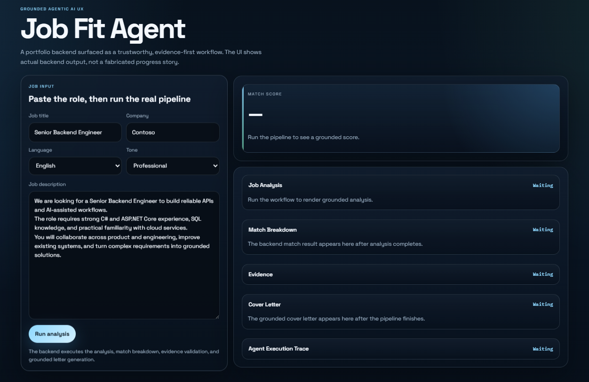
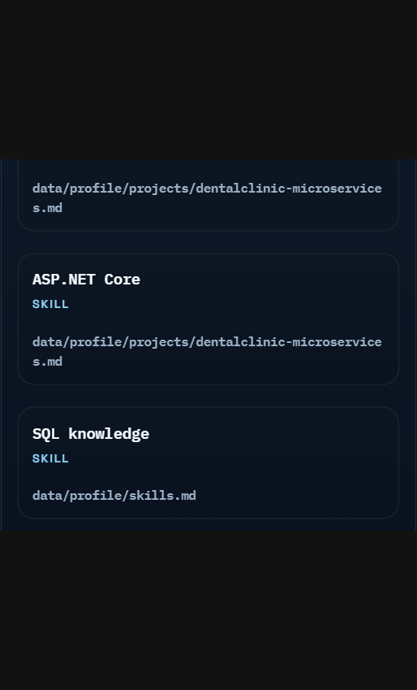
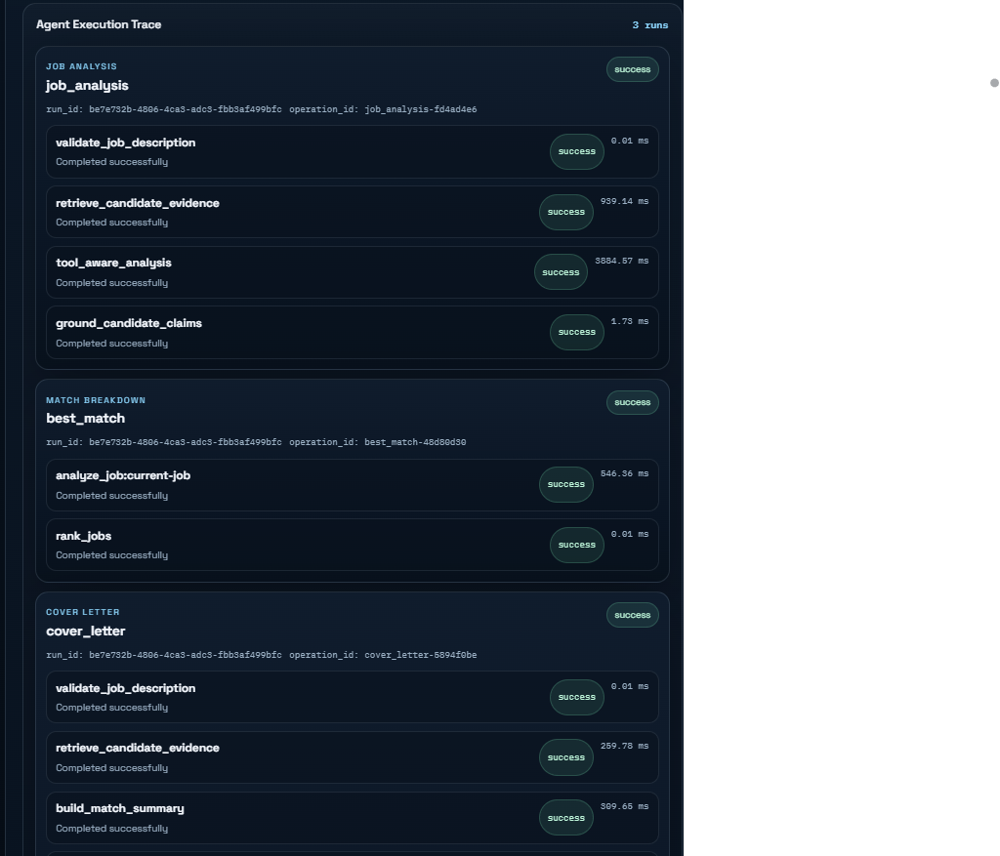
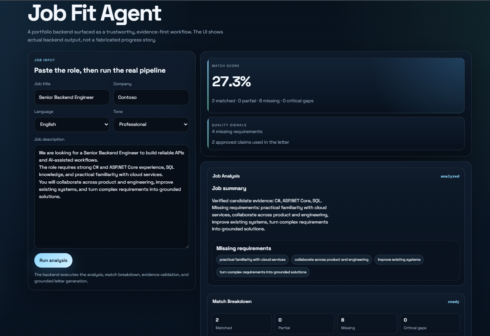
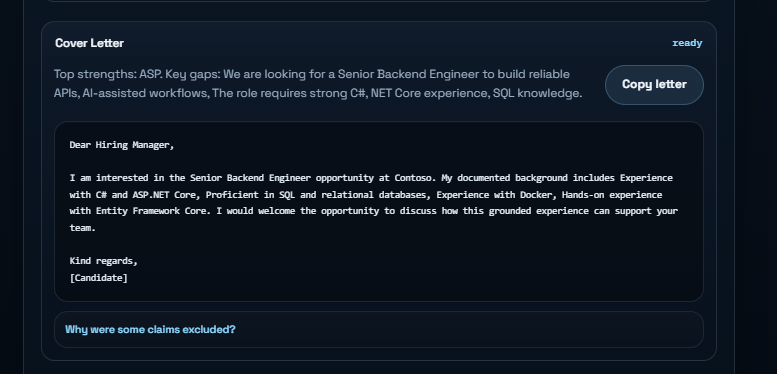

# Job Fit Agent

Job Fit Agent is an evidence-first job matching and cover-letter portfolio app. It retrieves canonical candidate evidence, validates claims with guardrails, computes a deterministic fit score, and presents the result through a React/Vite frontend with a real execution trace.

## Overview

The system turns a job description into a grounded analysis of candidate strengths, gaps, and fit. Candidate claims are supported by profile evidence before they can appear in match results or the generated cover letter.

## Screenshots

### Job Input



## Current Status

- Backend complete.
- Frontend + Agentic UX complete.
- The system uses grounded RAG, OpenAI structured outputs, candidate-claim guardrails, bounded function calling, deterministic matching, and execution trace reporting.
- Final live validation completed successfully after resolving the function-tool schema compatibility issue.
- `70` automated backend tests passed and the frontend build passed.
- Five representative live scenarios were validated: .NET/Backend, React/Frontend, DevOps/Cloud, AI/LLM, and an unsuitable role.
- RAG grounding, guardrail rejection of unsupported claims, tool calling, match analysis, cover-letter generation, and execution traces all completed successfully.
- Frontend build: successful.

## What It Does

- Job description analysis
- RAG-based candidate evidence retrieval
- OpenAI embeddings and a local vector index
- Bounded function calling through `search_candidate_evidence`
- Candidate claim guardrails
- Deterministic match scoring and critical gaps
- Match Breakdown
- Grounded evidence display
- Grounded cover letter generation
- Real execution trace and Run ID display
- React/Vite frontend for the full workflow

## Architecture

Frontend -> API -> Application Services -> Agent/RAG/Guardrails -> OpenAI / Evidence Provider -> Grounded Result

The backend routes are thin. Application services own orchestration and validation. Infrastructure owns OpenAI, RAG, and storage adapters. The frontend only calls the existing API and renders the returned result and trace.

Match Breakdown uses the approved candidate claims produced by Job Analysis after guardrail validation; its deterministic score and requirement statuses are not derived from unverified job-text claims.

## Agent Workflow

1. Validate the job description.
2. Retrieve candidate evidence through the RAG provider or the bounded evidence tool.
3. Let the LLM interpret the job and propose atomic candidate claims or requirements.
4. Validate every candidate claim with `validate_candidate_claim(...)`.
5. Build deterministic best-match output from approved claims.
6. Generate the final cover letter only from approved claims.
7. Return a real execution trace and the same Run ID through the response.

LLM is not the final authority for candidate facts or numeric match score.

## Grounding

Canonical candidate evidence -> Retrieval -> Candidate Claims -> Guardrails -> Approved Claims -> User-facing grounded output

Approved claims are the source of truth for candidate facts.

### Grounded Evidence



## Agent Tool

The only allowlisted tool is `search_candidate_evidence`.

- validated inputs
- bounded calls
- traceable evidence output
- still subject to the existing guardrails

### Agent Execution Trace



## Match Analysis



## Grounded Cover Letter



## Security / Reliability

- input validation
- tool allowlist
- bounded tool calls
- path and environment protection
- grounding guardrails
- deterministic scoring
- tests

## Run Locally

Backend:

```powershell
python -m venv .venv
.\.venv\Scripts\Activate.ps1
python -m pip install -r requirements.txt
python -m uvicorn app.main:app --reload
```

The health endpoint is available at `http://127.0.0.1:8000/health`.

The job-analysis endpoint is available at `POST http://127.0.0.1:8000/job-analysis` and requires `OPENAI_API_KEY`. It accepts a `job_description` and returns only candidate claims that pass the evidence guardrails.

The Best Match endpoint is available at `POST http://127.0.0.1:8000/best-match`. It performs evidence-grounded requirement extraction, deterministic weighting, required/preferred handling, and rank selection without using the LLM as the final authority for the numeric score.

The cover-letter endpoint is available at `POST http://127.0.0.1:8000/cover-letter`. It accepts a job description, title, company, language, and tone, then generates a grounded draft from approved candidate claims only. Unsupported or overstated claims are rejected and excluded from the final text.

Before using `/job-analysis`, build the local profile index from the canonical profile files:

```powershell
python -m app.infrastructure.rag.index
```

The index uses `EMBEDDING_MODEL`, `RAG_TOP_K`, `RAG_SIMILARITY_THRESHOLD`, and `VECTOR_STORE_PATH`. Generated index data is ignored and can be rebuilt.

Run tests from `backend/` with:

```powershell
python -m pytest
```

Frontend:

```powershell
cd frontend
npm install
npm run dev
```

The frontend runs at `http://127.0.0.1:5173` when launched with the default Vite settings.

## Testing

- `python -m pytest` -> `70 passed`
- `npm run build` -> successful

## Project Direction

The architecture and agent workflow are documented in [docs/architecture.md](docs/architecture.md) and [docs/agent-spec.md](docs/agent-spec.md). Wave decisions and verification evidence are tracked in [progress-log.md](progress-log.md).

Candidate source documents are maintained under `data/profile/`. They are the source of truth for future retrieval and grounded AI output.

Wave 3.1 evaluation cases are maintained separately in `data/evaluation/jobs.json`, with the methodology in [evaluation/README.md](evaluation/README.md) and the report in [evaluation/reports/wave-3.1-report.md](evaluation/reports/wave-3.1-report.md). The project lifecycle includes `LLM -> evaluation -> improvement`.

## Configuration

- `.env.example` documents the required local settings without exposing secrets.
- `OPENAI_API_KEY` is required for live OpenAI-backed paths.
- `OPENAI_MODEL` controls the structured job-analysis and cover-letter adapters.
- `EMBEDDING_MODEL`, `RAG_TOP_K`, `RAG_SIMILARITY_THRESHOLD`, and `VECTOR_STORE_PATH` control the local RAG index and retrieval behavior.

## Repository Layout

```text
backend/
frontend/
data/
docs/
evaluation/
README.md
progress-log.md
.env.example
```
